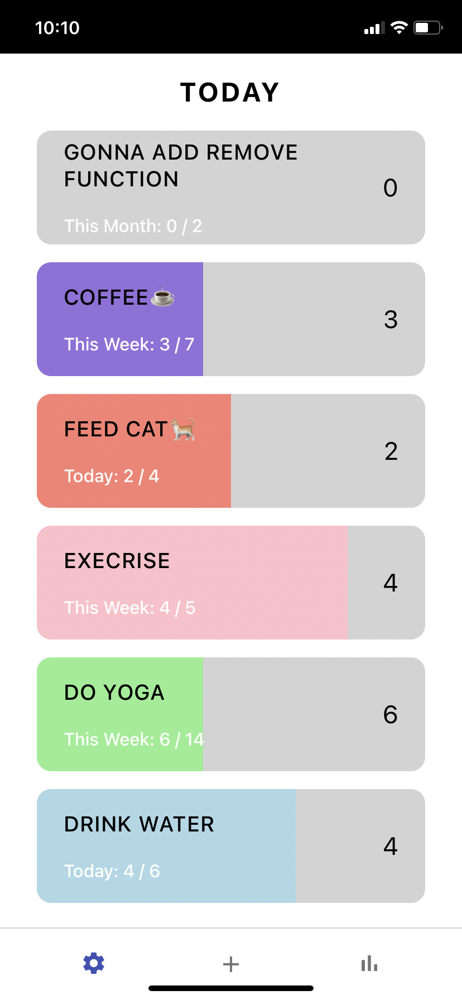
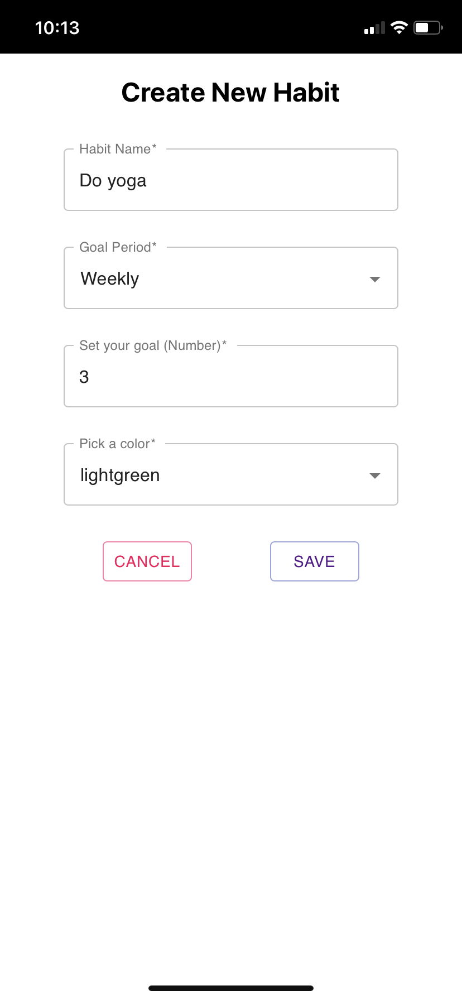

<!--
*** Thanks for checking out the Best-README-Template. If you have a suggestion
*** that would make this better, please fork the repo and create a pull request
*** or simply open an issue with the tag "enhancement".
*** Thanks again! Now go create something AMAZING! :D
***
***
***
*** To avoid retyping too much info. Do a search and replace for the following:
*** github_username, repo_name, twitter_handle, email, project_title, project_description
-->

<!-- PROJECT SHIELDS -->
<!--
*** I'm using markdown "reference style" links for readability.
*** Reference links are enclosed in brackets [ ] instead of parentheses ( ).
*** See the bottom of this document for the declaration of the reference variables
*** for contributors-url, forks-url, etc. This is an optional, concise syntax you may use.
*** https://www.markdownguide.org/basic-syntax/#reference-style-links
-->

<!-- PROJECT LOGO -->
<br />
<p align="center">

  <h3 align="center">Habit Tracker App</h3>

  <p align="center">
    A Habit Tracker built with React and TypeScript
    <br />
    <a href="https://habit-tracker-ts.web.app/">View Demo</a>
    ·
    <a href="mailto:ethanshi0725@gmail.com">Report Bug</a>
  </p>
</p>

<!-- TABLE OF CONTENTS -->
<!-- no need atm -->

<!-- ABOUT THE PROJECT -->

## About The Project

<p align="center">
  
  
</p>

### Built With

-   React
-   TypeScript
-   Firebase
-   styled-components
-   React-hook-form
-   React Router

<!-- GETTING STARTED -->

## Getting Started

### `yarn start`

Runs the app in the development mode.\
Open [http://localhost:3000](http://localhost:3000) to view it in the browser.

The page will reload if you make edits.\
You will also see any lint errors in the console.

## Instruction

#### Install all the dependencies, run

```
yarn install
```

#### To serve the application, run

```
yarn start
```

<!-- USAGE EXAMPLES -->

<!-- ROADMAP -->

## Roadmap

-   Integrate Google Auth to allow user to register account
-   Settings Page
-   Statistics Page
-   Dark mode

See the [open issues](https://github.com/github_username/repo_name/issues) for a list of proposed features (and known issues).

<!-- LICENSE -->

## License

Distributed under the MIT License. See `LICENSE` for more information.

<!-- ACKNOWLEDGEMENTS -->
